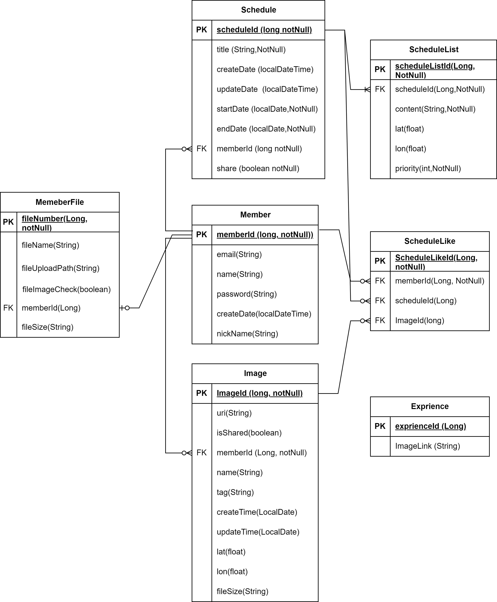
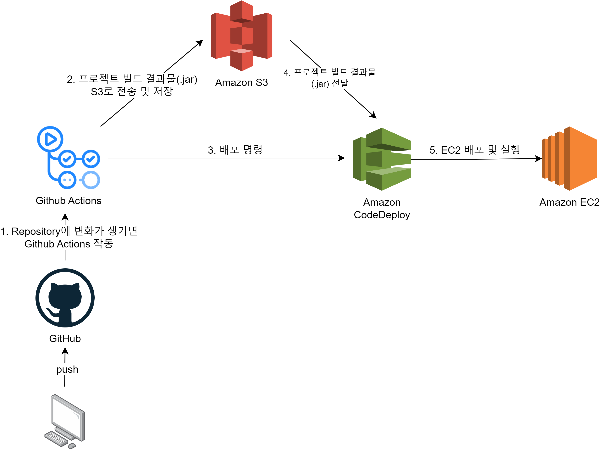

# Tour Mate

Tour Mate는 여행 일정과 사진을 생성, 관리, 기록, 공유하기 위한 서비스 입니다.

- **Project**: Tour Mate

- **Development Duration**: `2023.12.10~2023.3.15`

 

## 👪Team

### Frontend
| 김수성                                             |         
|---------------------------------------------------|
| [@KimSuSung0326](https://github.com/KimSuSung0326)|

### Backend
| 김리나                                             |백도담                                             |도희정                                             |  
|:---------------------------------------------------:|:---------------------------------------------------:|:---------------------------------------------------:|
| [@LinaKK](https://github.com/LinaKK)| [@BAEKDODAM](https://github.com/BAEKDODAM)| [@dev-learning1](https://github.com/dev-learning1) |

 

## ✍Tech Stack

### Backend
      

### Frontend
     

### WorkTool
   

 

## Docs
**Team Page**: [Notion URL](https://www.notion.so/8b4a7f6ee94f484e80258962fa46e41b)

 

### 화면정의서
[Tourmate figma](https://www.figma.com/file/PCGlNKOdIgeRHEdlxunX2w/Untitled?type=design&mode=design&t=RoJ5AGkCDePwRaXs-1)

 

### DB Schema

 

### API 명세서
[API 명세서](http://tm.greennare.store/swagger-ui/#/)

 

### 배포

